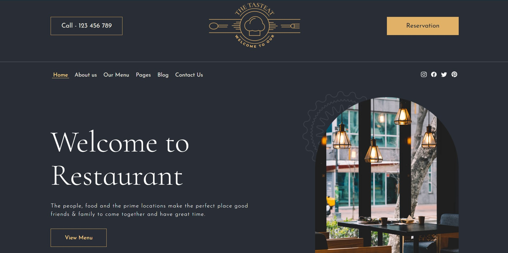
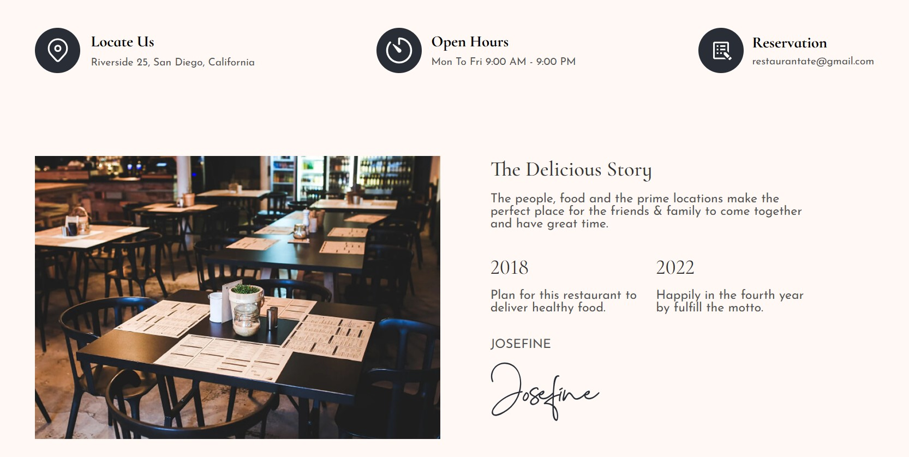
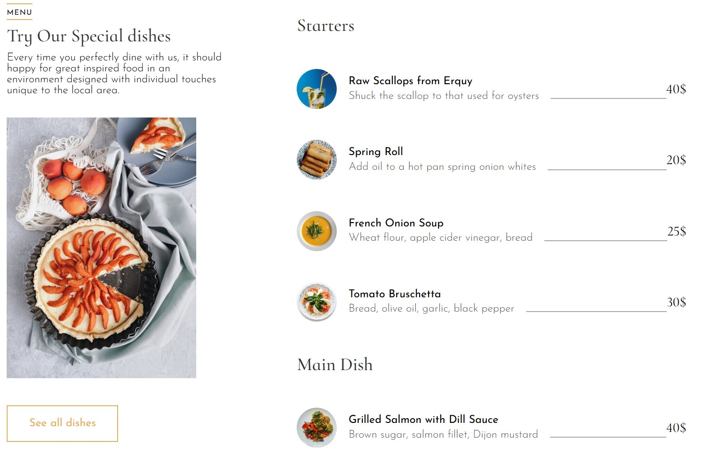

## KeepSolid Internship - TastEat

[TastEat](https://dashwisher.github.io/TastEat.github.io/main.html) is a website that providing restaurant services.

It consists of two pages:
- main page where you can find general information;
- reservation page where you can book a table for yourself.


## File system:
```
TastEat <br>
├── css/<br>
│   ├── header_footer.css<br>
│   ├── main.css<br>
│   ├── reservation-main.css<br>
│   └── style.css<br>
├── images/<br>
├── js/<br>
│   └── open_page_events.js<br>
├── main.html<br>
├── reservation.html<br>
└── README.md<br>
```
## Screenshots








Author: Andrew Miroshkin<br>
Group: ІПЗ-4.04<br>
The project is your developer as part of an internship at KeepSolid.